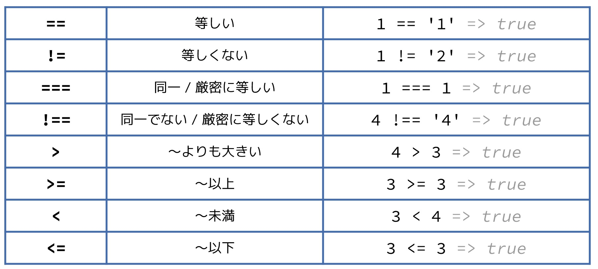

# 第2回

## JavaScript で論理を扱う

ここでは

1. 比較演算子
1. if文
1. 論理演算子

を学ぶ。

### 比較演算子

2 > 1 の「>」みたいなやつ



### if文

条件が2つの時は

```js
if (a) {
  // 論理式 a の値が真の時に実行したい処理
} else {
  // 論理式の値が偽の時に実行したい処理
}
```

条件が3つ以上ある時は

```js
if (a) {
  // 論理式 a の値が真の時に実行したい処理
} else if (b) {
  // 論理式 a の値が偽、かつ、論理式 b の値が真の時に実行したい処理
} else {
  // 論理式の値が偽の時に実行したい処理
}
```

### 比較演算子を使ったプログラム

`年齢が 20 歳以上の時は「成年」、それ以外は「未成年」と出力する`

というプログラムを書いてみる。

js-logic.html に以下を追加

```html
<!DOCTYPE html>
<html lang="ja">
<head>
  <meta charset="UTF-8">
  <meta name="viewport" content="width=device-width, initial-scale=1.0">
  <title>JavaScriptで扱う論理</title>
</head>
<body>
  <script src="logic.js"></script>
</body>
</html>
```

logic.js に以下を追加

```js
var age = 16;
var result = null;
if (age >= 20) {
  result = '成年';
} else {
  result = '未成年';
}
document.write(result);
```

### 論理演算子

!, ||, &&といったもの（画像参照）

### 論理演算子を用いたプログラム

`60 歳以上で、なおかつポイント会員に対して『シニア会員割引』がある映画館`

を考える。

logic.js を以下のように変更

```js
var age = 65;
var isMember = true;
var result = null;
if (age >= 60 && isMember) {
  result = 'シニア会員割引の対象です';
} else {
  result = 'シニア会員割引の対象ではありません';
}
document.write(result);
```

### 練習問題

15 歳以下は 800 円、ポイント会員の場合には 1000 円、 そうではない場合には 1800 円の映画のチケットがあります。
年齢と会員であるかどうかを変数に代入すると、チケットの値段を教えてくれるプログラムを書いてみましょう。
なお、15 歳以下かつ会員の場合には、 800 円 になるものとします。
例として、16 歳の会員のチケットの値段を出して下さい。

ヒント：

1. 習った else if を使うことができます
1. 問題文にある条件を整理すると、以下のようになります。

   - 15 歳以下なら会員であるかどうかを問わず 800 円
   - 16 歳以上の会員は 1000 円
   - それ以外は 1800 円

<!-- ### 練習問題の答え

```js
var age = 16;
var isMember = true;
var result = null;
if (age <= 15) {
  result = 800;
} else if (isMember) {
  result = 1000;
} else {
  result = 1800;
}
document.write(result);
```

ブラウザで表示したとき、

`1000`

が表示されればOK -->
